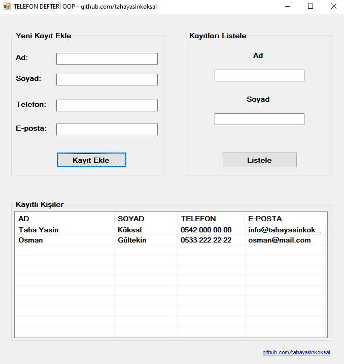

# C# OOP Telefon Defteri Example
Bu proje sayesinde basit düzeyde OOP (Nesen yönelimli programlama) nın basit olarak mantığını kavrayabilirsiniz.  

Temel olarak <b>yeni kayıt</b> ekleme ve eklenen kayırları <b>filitreleyerek</b> listeleme işlemleri yapılmakta.  
<h6>Denenmek istenirse projenin ana dizinine ekli olan <a href="https://github.com/tahayasinkoksal/c-OOP-TelefonDefteri-example/raw/master/TelefonDefteri.exe"><b>TelefonDefteri.exe</b></a> denenebilir.</h6>

<h3>Ekran Görüntüsü
</h3>

<b>Contact</b> 

<b>Mail:</b> info@tahayasinkoksal.com.tr  
<b>Web:</b> www.tahayasinkoksal.com.tr  
<b>Instagram:</b> <a href="https://instagram.com/tahayasinkoksal">instagram.com/tahayasinkoksal</a>

